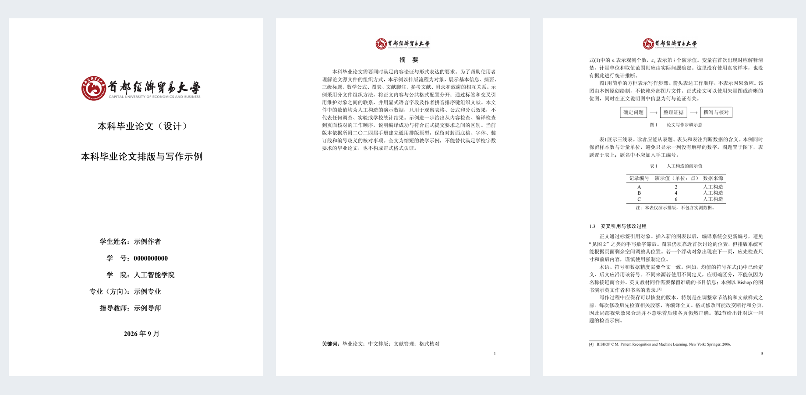

# CUEBThesis：首经贸本科毕业论文 LaTeX 模板

**面向首都经济贸易大学人工智能学院本科生的论文与毕业设计排版模板。**

你负责写论文，模板负责统一字体、标题、页眉、目录、图表编号和参考文献格式。即使以前没有用过 LaTeX，也可以按下面的步骤，先生成一份示例 PDF，再逐步换成自己的内容。

**第一次使用，先完成三件事：下载整个项目 → 把字体模式改为 `preview` → 编译 `main.tex`。** 暂时不用研究模板代码，也不用安装 Python。

> 本项目由词元工作室独立实现，是非官方模板。排版以2024届指导手册为基础，并做了标题居中、校徽等比例显示和页眉留白等调整。使用前请确认学院允许提交 PDF，以及当届格式和封面要求。自动生成的封面样式是暂拟打印扉页，不能直接视为学校统一封面。

## 先看看能做出什么



*实际编译效果：封面信息、中文摘要、正文图表与文献脚注。图中身份信息与数据都是示例。*

模板已提供：

- 封面信息填写、中英文摘要、关键词和自动目录。
- 三级标题、公式、图片、三线表和跨页表。
- 当页文献脚注、自动整理的文末参考文献。
- 附录、致谢，以及带校徽的页眉。
- 预览字体和正式字体两种模式。

**示例是一份排版教程，不是一篇可以直接提交的毕业论文。** 里面的文字、题目、姓名、学号、数据和引用都需要按你的实际论文替换。

## 使用导航

1. [下载模板](#download)
2. [第一次编译：选择在线或本地方式](#first-build)
3. [填上自己的姓名、学号和论文题目](#metadata)
4. [找到需要修改的文件](#files)
5. [开始写摘要和正文](#writing)
6. [插入图片、表格和公式](#objects)
7. [添加参考文献和引用](#references)
8. [每天怎样保存、编译和备份](#daily)
9. [正式提交前的字体与格式检查](#submission)
10. [遇到报错怎么办](#troubleshooting)

<a id="download"></a>
## 1. 下载模板

不用 Git，也可以下载：

1. 点击 [下载完整 ZIP 压缩包](https://github.com/kayzhou/CUEBThesis/archive/refs/heads/main.zip)。也可以在仓库页面点击绿色 **Code → Download ZIP**。
2. 在电脑上解压。解压后的文件夹通常叫 `CUEBThesis-main`。
3. 打开文件夹，确认里面能看到 `main.tex`、`cuebsetup.tex`、`cuebthesis.cls` 和 `data` 文件夹。

**请下载整个项目，不要只保存一个 `main.tex`。** 模板、校徽和参考文献样式都在其他文件里，缺少它们会编译失败。

建议将文件夹放在容易找到的位置，例如 Windows 的 `D:\Thesis\CUEBThesis-main`，或 macOS 的“文稿”文件夹。图片和正文文件尽量使用简短的英文文件名，如 `model.png`、`03-results.tex`。

<a id="first-build"></a>
## 2. 第一次编译：先得到一份 PDF

### 先认识三个词

| 名称 | 你可以这样理解 |
| --- | --- |
| LaTeX | 根据文字和少量排版命令，生成论文 PDF 的工具 |
| `.tex` 文件 | 你编辑的论文源文件，用纯文本保存 |
| 编译 | 把这些源文件转换成 PDF；每次改完文字，都要重新编译才能看到结果 |

**你写的是 `.tex`，交给老师看的通常是 `.pdf`。** 不要直接在生成的 PDF 上改正文，否则下次编译时这些改动不会保留。

下面两条路线任选一条即可。对完全没有 LaTeX 经验的同学，优先推荐使用能读取项目文件并运行终端命令的 AI 工具来完成第一次编译。

| 方式 | 适合谁 | 需要准备什么 |
| --- | --- | --- |
| **A. 在线编辑** | 希望先试用，不想安装大型软件 | 浏览器和 Overleaf 账号 |
| **B. 本地编辑** | 希望离线写作，或使用本机正式字体 | TeX Live / MacTeX，以及文本编辑器 |

### A. 在线使用 Overleaf

1. 打开 [Overleaf](https://www.overleaf.com/)，登录账号。
2. 选择 **New Project → Upload Project**（新建项目 → 上传项目），上传刚下载的 ZIP 压缩包。
3. 在文件列表中找到 `main.tex`。打开项目设置，将 **Main document / 主文档** 设为它。
4. 在项目设置中，把 **Compiler / 编译器** 改为 **XeLaTeX**。不要保留默认的 pdfLaTeX。
5. 打开 `cuebsetup.tex`，找到下面这一行中的 `submission`：

   ```latex
   font-profile    = submission,
   ```

   改成：

   ```latex
   font-profile    = preview,
   ```

6. 点击 **Recompile / 重新编译**。第一次需要处理字体、目录和参考文献，等它完成。
7. 右侧应显示示例论文；点击 PDF 下载按钮，可以保存到电脑。

**成功标志：能看到封面、“摘要”、目录和正文，引用处没有 `??` 或未处理的引用键。**

仓库的主示例默认使用正式字体，而在线环境不一定具备这些字体。因此第一次使用请明确切换到 `preview`。本机安装了宋体，也不代表 Overleaf 能使用它。在线操作入口可能随界面更新变化；本项目当前的逐页排版验证来自本地环境，尚未完成 Overleaf 实测。

如果在线编译超时，可先把主文档暂时设为 `examples/minimal.tex`，检查三页最小示例是否能生成；它不包含完整论文结构，正式写作仍应切回 `main.tex`。持续超时可使用下面的本地方式。

### B. 使用本地 AI 工具协助编译

如果你不熟悉命令行，推荐使用 [Claude Code](https://docs.anthropic.com/en/docs/claude-code)，也可以使用 Codex、Cursor、WorkBuddy 或其他能够读取本地文件并运行终端命令的 AI 工具。先用编辑器打开解压后的整个 `CUEBThesis-main` 文件夹，再把下面这段话发给 AI：

```text
这是一个 LaTeX 毕业论文模板。请在当前项目根目录检查编译环境，使用 XeLaTeX 和 latexmk 编译 main.tex，必要时运行 Biber；如果缺少字体，先把 cuebsetup.tex 的 font-profile 改为 preview。请不要删除或重写模板文件，编译完成后告诉我 PDF 的位置和第一条真正的报错。
```

AI 工具会根据你的操作系统检查 TeX Live / MacTeX、XeLaTeX、Biber 和 latexmk 是否可用，并执行项目需要的编译步骤。编译成功后，打开 **`build/main.pdf`**。你每次修改正文后，都可以让 AI 再次编译并检查日志。

使用 AI 时请注意：

- 让它在**包含 `main.tex` 的项目根目录**工作，不要单独编译 `data` 文件夹里的章节。
- 第一次使用建议将 `font-profile` 设为 `preview`；正式提交时再在已安装指定字体的环境中切换为 `submission`。
- 把 AI 的修改限制在你的正文、配置、图片和文献文件；不要让它随意改写 `cuebthesis.cls`、`config/` 或文献样式文件。
- AI 报告“编译成功”后，仍要亲自打开 PDF，检查封面、目录、引用、图表和页码。

如果你想自己安装和运行 LaTeX，项目依赖 XeLaTeX、latexmk、Biber、CTeX、`biblatex` 和 `biblatex-gb7714-2015`。完整安装 TeX Live（Windows/Linux）或 MacTeX（macOS）通常最省事；详细命令只放在文末的维护者命令和[常见问题](#troubleshooting)中。

<a id="metadata"></a>
## 3. 填上自己的信息

打开 **`cuebsetup.tex`**。第一次练习，可以把文件内容替换成下面的例子，再改成自己的真实信息：

```latex
\cuebsetup{
  standard        = cueb-2024,
  college-profile = artificial-intelligence,
  font-profile    = preview,
  numbering       = continuous,
  thesis-type     = research,
  title           = {在这里填写中文论文题目},
  title*          = {Write Your English Thesis Title Here},
  author          = {你的姓名},
  student-id      = {你的学号},
  major           = {你的专业},
  supervisor      = {导师姓名},
  date            = {2026年6月}
}
```

保存后重新编译，检查封面是否已经变成你的信息。日期也请按实际情况修改。

填写时注意：

- **只替换花括号 `{}` 里面的文字**，保留命令、等号和行末逗号。
- 使用英文半角符号，不要把 `,` 改成中文 `，`，也不要把 `{}` 改成其他括号。
- `title*` 保存英文题目信息；当前自动扉页只展示中文题目，英文题目不会自动加到封面。
- 默认学院名称是“人工智能学院”。如果你属于其他学院，把 `college-profile` 改为 `general`，并在同一组配置中添加 `department = {你的学院名称},`。更换学院名称不会自动满足其他学院的格式要求。

以下选项可以先保留默认值：

| 选项 | 含义 |
| --- | --- |
| `font-profile = preview` | 使用容易获得的预览字体，适合第一次编译和写草稿 |
| `font-profile = submission` | 使用宋体、黑体和 Times New Roman，需要提前安装这些字体 |
| `numbering = continuous` | 图、表、公式分别从1开始，全文连续编号 |
| `numbering = section` | 按一级标题编号，例如图1.1、图2.1；是否使用以学院要求为准 |
| `thesis-type = research` | 研究论文；文献综述用 `review`，毕业设计用 `design` |

论文类型主要影响参考文献数量等提醒，**不会替你生成论文内容或调整章节结构**。

<a id="files"></a>
## 4. 写论文时，主要改哪些文件

| 你要做什么 | 打开哪个文件 |
| --- | --- |
| 修改题目、姓名、学号、专业、导师、日期 | `cuebsetup.tex` |
| 写中英文摘要和关键词 | `data/abstract.tex` |
| 写正文第一部分 | `data/01-writing.tex` |
| 写正文第二部分 | `data/02-validation.tex` |
| 写附录 | `data/appendix.tex` |
| 写致谢 | `data/acknowledgements.tex` |
| 添加、修改参考文献 | `ref/refs.bib` |
| 放自己的图片 | `figures/` 文件夹 |
| 增加章节、调整各部分的顺序 | `main.tex` |
| 查看最终结果 | 本地打开 `build/main.pdf`；在线查看 PDF 预览 |

`cuebthesis.cls`、`config/`、`.bbx` 和 `.cbx` 文件负责统一格式。一般写作时不需要修改。保留 `assets/cueb-logo.png`，它是封面和页眉使用的校徽字标。

<a id="writing"></a>
## 5. 开始写摘要和正文

### 摘要：保留结构，替换文字

打开 `data/abstract.tex`，把示例文字换成你的中英文摘要。结构如下：

```latex
\begin{cuebabstract}
这里填写中文摘要，说明研究问题、研究方法、主要结果和结论。

\cuebkeywords{关键词一；关键词二；关键词三}
\end{cuebabstract}

\begin{cuebabstract*}
Write your English abstract here.

\cuebkeywords{keyword one; keyword two; keyword three}
\end{cuebabstract*}
```

带星号的 `cuebabstract*` 表示英文摘要。模板会自动生成居中的“摘要”和“Abstract”标题，**不要再手写一个同名标题**。关键词会放在摘要页下方；最终篇幅和关键词数量以学院要求为准。

### 正文：用标题命令组织内容

打开 `data/01-writing.tex`，用自己的内容替换示例。例如：

```latex
\section{绪论}

这里写研究背景。中文可以直接输入，不需要给每句话加命令。

空一行表示开始一个新段落。首行缩进由模板处理，不用手动敲空格。

\subsection{研究背景与意义}

这里写二级标题下的内容。

\subsubsection{研究背景}

这里写三级标题下的内容。
```

`\section`、`\subsection`、`\subsubsection` 分别生成一、二、三级标题。**不要在标题文字里再输入“1”“1.1”等编号**，模板会自动生成。

几个马上用得上的规则：

| 想表达什么 | 怎样写 |
| --- | --- |
| 新起一段 | 两段之间空一行；只在编辑器中按一次回车通常不会新起一段 |
| 加粗文字 | `\textbf{需要强调的文字}` |
| 写一条给自己看的备注 | `% 这行是备注，不会出现在PDF中` |
| 普通文字中的百分号 | `95\%` |
| 普通文字中的下划线 | `data\_set` |
| 普通文字中的 `&`、`#`、`$` | 分别写 `\&`、`\#`、`\$` |
| 网页地址 | `\url{https://example.com}` |

花括号和 `\begin{...}` / `\end{...}` 要成对出现。先保留示例结构、逐段改文字，通常比一次性删除所有内容更容易检查。

### 增加“第三部分”或更多章节

1. 在 `data` 文件夹中新建 `03-results.tex`，注意后缀是 `.tex`，不是 `.tex.txt`。
2. 在里面写 `\section{实验结果与分析}` 和正文。**不要添加 `\documentclass` 或 `\begin{document}`**，这些只在主文件中出现。
3. 打开 `main.tex`，在 `\cuebprintbibliography` 之前加入：

   ```latex
   \input{data/03-results}
   ```

`\input` 的意思是“在这里插入另一个文件的内容”。**只创建新文件而不在 `main.tex` 中引用，它不会出现在论文里。**

主文件决定论文顺序：

```text
封面 → 中英文摘要 → 目录 → 正文各部分 → 参考文献 → 附录 → 致谢
```

目录会根据标题自动更新，不需要手工修改页码。如果不需要附录，在 `main.tex` 中同时删除或注释 `\cuebappendix` 和 `\input{data/appendix}` 两行。致谢标题也由主文件生成，`data/acknowledgements.tex` 中直接写致谢内容即可。

<a id="objects"></a>
## 6. 插入图片、表格和公式

下面的例子放在 `data/` 中的正文文件里，**不要放到 `cuebsetup.tex` 中**。

### 插入一张图片

先将自己的图片保存为 `figures/model.png`。然后在正文中写：

```latex
本文的研究流程如图\ref{fig:model}所示。

\begin{figure}[htbp]
  \centering
  \includegraphics[width=0.8\linewidth]{figures/model.png}
  \caption{研究流程图}
  \label{fig:model}
\end{figure}
```

- **必须先放入图片文件**，再使用这段代码；`model.png` 是这里约定的示例文件名，仓库没有自带这张图。
- `0.8\linewidth` 表示图片宽度为当前正文宽度的80%，可按需要调整。
- `\caption{...}` 写图题，编号自动添加；`\label{...}` 给图片起一个内部名字。
- 正文用 `\ref{fig:model}` 引用图号，不要手写“图1”。每张图的标签必须不同。
- 图片可能被排到当前页其他位置或下一页，这是浮动排版的正常行为；`[htbp]` 表示允许放在当前位置、页顶、页底或单独一页。

可以使用 PNG、JPG 和 PDF 图片。优先使用清晰原图；图题放在图片下方，说明数据或图片来源时也请注明真实来源。

### 插入一个三线表

```latex
表\ref{tab:demo}展示了排版用的示例数据。

\begin{table}[htbp]
  \centering
  \caption{示例数据（仅演示排版）}
  \label{tab:demo}
  \begin{tabular}{lcc}
    \toprule
    方法 & 指标一 & 指标二 \\
    \midrule
    方法A & 0.80 & 0.75 \\
    方法B & 0.85 & 0.79 \\
    \bottomrule
  \end{tabular}
\end{table}
```

`&` 分隔单元格，`\\` 结束一行。`{lcc}` 表示共三列，分别左对齐、居中、居中。新增一列时，需要同时修改列格式和每行单元格数量。表题放在表格上方。

长表需要跨页时，可以参考 `data/appendix.tex` 中的 `longtable` 示例。

### 插入公式

行内公式写在一对 `$` 之间，例如：

```latex
设样本数量为 $n$，第 $i$ 个观测值为 $x_i$。
```

需要独立显示并编号的公式：

```latex
\begin{equation}
  \bar{x} = \frac{1}{n}\sum_{i=1}^{n}x_i
  \label{eq:average}
\end{equation}

式\eqref{eq:average}给出了样本均值的计算方式。
```

`\eqref` 会带上公式编号的括号。第一次编译后若编号尚未出现，再完成一轮编译；本地使用上述 `latexmk` 命令会自动处理所需轮次。

<a id="references"></a>
## 7. 添加参考文献和引用

参考文献分两步：**先在文献库里记录来源，再在正文中引用它。**

### 第一步：把文献信息放进 `ref/refs.bib`

文件中的 `zhou2016` 已经是一个可用例子：

```bibtex
@book{zhou2016,
  author    = {{周志华}},
  title     = {机器学习},
  location  = {北京},
  publisher = {清华大学出版社},
  date      = {2016},
  langid    = {chinese},
  sortkey   = {ZhouZhihua2016}
}
```

**这条记录已存在，不要再粘贴一份同名记录。** 这里是让你看懂它的结构：

- `@book` 表示图书；期刊论文通常用 `@article`，会议论文通常用 `@inproceedings`。
- `zhou2016` 是引用键，相当于这条文献的唯一名字；正文引用时要完全一致。
- `author`、`title`、`date` 等字段记录作者、题名、年份等真实信息。
- 中文文献建议填写 `langid = {chinese}`，并用 `sortkey` 写作者拼音排序键，帮助文末按顺序排列。

添加自己的文献时，可以从论文出版页面或 Zotero 等文献管理工具导出 **BibTeX / BibLaTeX** 格式，再粘贴到 `refs.bib` 末尾。检查作者、题名、年份、期刊、卷期、页码是否正确，并保证引用键不重复。导出结果也可能有错，不能直接当作已经核实的书目信息。

### 第二步：在正文中引用

```latex
有关机器学习基础概念的介绍可参见相关教材。\cuebcite{zhou2016}
```

编译后，模板会自动生成**当页的文献脚注**，并在文末参考文献中列出这条来源。不要自己敲上角标 `[1]`，也不要手写整段参考文献列表。

本模板的引用行为是：

- 同一篇来源再次引用，会生成一个新的脚注号，并再次显示完整文献信息。
- 文末同一篇参考文献只列一次，默认只列已引用的来源。
- 脚注号和文末参考文献序号独立编号，不要求一一对应。
- 中文文献在前，组内按排序键排列；外文按作者字母排序。

如果需要标注实际引用页码，可写 `\cuebcite[23--25]{zhou2016}`，其中页码必须替换为你实际阅读、核实的页码。多篇来源分别标页码的用法见[进阶说明](docs/quickstart.md#3-引文与文献库)。

普通解释性脚注使用：

```latex
这里需要补充说明。\footnote{在这里填写解释性文字。}
```

它与文献脚注共用计数，但不会自动成为文末的一条参考文献。

> 示例文献只是演示排版，不能自动成为你论文的研究依据。删除示例条目前，先删除或替换正文中对应的引用，否则会出现找不到引用的错误。

<a id="daily"></a>
## 8. 每天写作时怎么用

建议按这个顺序：

1. 修改少量文字，保存源文件。
2. 在线点击 Recompile；本地让 AI 工具重新编译项目。
3. 检查刚修改的页面，以及目录、图表编号和引用是否正常。
4. 每完成一段重要工作，备份一次整个项目文件夹，或使用 Git 保存版本。

**备份的是整个源文件夹，不能只备份 PDF。** `.tex`、`.bib` 和图片一起，才能重新生成论文。修改结构或大段替换之前，先留一个可恢复的版本。

老师只需要阅读时，通常发送生成的 PDF；如果老师要求可编辑的 Word 文件，请先沟通提交方式。本模板输出 PDF，不直接生成与该版式完全等价的 Word 文档。

<a id="submission"></a>
## 9. 正式提交前再检查一次

### 换成正式字体

主示例下载后的默认设置是 `submission`。如果你按入门步骤改成了 `preview`，提交前应在**已具备指定字体的环境**中改回：

```latex
font-profile = submission,
```

需要系统能识别以下字体：

| 字体名称 | 用途 |
| --- | --- |
| `SimSun`（宋体） | 中文正文等 |
| `SimHei`（黑体） | 中文标题等 |
| `Times New Roman` | 英文正文等 |

字体文件不随项目提供。使用你有权使用的字体文件：Windows 通常右键选择安装；macOS 可以双击后在“字体册”中安装，再重新打开编辑器。macOS 的“宋体-简 / Songti SC”不等于这里的 `SimSun`。

正式模式缺字体时会报错，不会悄悄换成别的字体。切换字体后可能改变断行和分页，**必须重新编译并逐页检查最终 PDF**。在线平台的正式字体配置与本机不同，没有配置成功时可以先在本地完成最终编译。

### 核对内容和版式

- [ ] 题目、姓名、学号、学院、专业、导师和日期都已替换为自己的信息。
- [ ] 示例文字、人工构造数据和不再使用的示例引用已清理。
- [ ] 中英文摘要、关键词、正文、参考文献、附录和致谢完整，且符合实际要求。
- [ ] 目录页码和图表公式编号正确，没有 `??`、缺字、文字重叠或超出页面。
- [ ] 引用的来源和页码已经核实，文献数量、外文文献要求及论文篇幅符合学院规定。
- [ ] 已核对当届规范、正式字体、页眉、页边距和学校要求的封面。
- [ ] 保存了最终 PDF，也备份了全部源文件。

所依据的2024届手册列有中文论文一般8000～10000字等要求；示例只有少量教学内容和五条文献，不满足正式论文篇幅与文献数量要求。**当前学院通知优先。** 模板的数量提醒只是辅助检查，不代表论文已达到提交标准。

### 如果学院提供了统一封面

将确认过的封面 PDF 放到 `assets/approved-cover.pdf`，在 `cuebsetup.tex` 的 `\cuebsetup{...}` 中增加一项：

```latex
cover-file = {assets/approved-cover.pdf},
```

这一项会在论文最前面插入外部 PDF，**当前模板仍会保留自动生成的打印扉页**。是否需要两者同时保留，应以学校要求为准。当前模板不包含开题报告、指导记录、评阅表和答辩表。

<a id="troubleshooting"></a>
## 10. 遇到报错怎么办

先保存文件，然后看编译日志中的**第一条真正的错误**。一个漏掉的括号，可能让后面连续出现很多错误；不要从最后一条开始盲目修改。

在线可以打开编译日志面板；本地可以看终端输出和 `build/main.log`。修改后再次编译，并确认 PDF 已更新，避免误把上次成功生成的旧 PDF 当成本次结果。

| 现象或报错 | 先这样处理 |
| --- | --- |
| `latexmk` 不是内部或外部命令，或 `command not found` | 检查是否已经安装 TeX Live / MacTeX；重新打开编辑器和终端，仍不行则检查安装时的 PATH 设置 |
| 提示只能用 XeTeX / XeLaTeX | 在线把编译器设为 **XeLaTeX**；本地使用本页的 `latexmk` 命令，不要直接使用 pdfLaTeX |
| `Submission font 'SimHei' is not installed` 等缺字体提示 | 初次使用先将 `font-profile` 改为 `preview`；正式排版时安装报错中指定的字体 |
| 找不到 `cuebthesis.cls`、校徽或 `config` 文件 | 重新确认下载了整个项目，并从含 `main.tex` 的文件夹编译；在线确认主文档选择正确 |
| `File 'figures/model.png' not found` | 示例代码引用了图片，但你还没有放入对应文件；检查文件名、大小写和后缀是否一致 |
| `gb7714-2005.bbx not found` | 通过 TeX 发行版管理器安装 `biblatex-gb7714-2015` 宏包；包名含2015，也提供模板使用的2005样式 |
| `Missing $ inserted` | 先检查普通文字中的 `_` 是否需要写成 `\_`，或者数学内容是否漏了成对的 `$` |
| `Runaway argument`、`Missing }` | 检查最近修改处是否少了 `}`，以及 `\begin` / `\end` 是否成对 |
| 图表、公式显示 `??` | 检查 `\label` 和 `\ref` 的名字是否一致，再完成重新编译；不要手工改编号 |
| 引用显示 `zhou2016` 等键名，或提示 `Citation ... undefined` | 检查 `refs.bib` 中是否存在同名条目，拼写是否相同；使用 latexmk 完成 Biber 与后续编译 |
| Biber 与 biblatex 版本不兼容 | 通过同一个 TeX 发行版管理器配套更新，避免只从别处替换单个程序 |
| macOS 旧版 Biber 报 `lipo` 或架构提取错误 | 这是本机工具兼容问题，优先安装匹配的较新 MacTeX；不要修改文献内容来绕过它 |
| 本地无法覆盖或写入 PDF | 关闭可能锁定文件的外部 PDF 阅读器，再编译，Windows 上尤其常见 |
| `Overfull ...`、文字伸出页边，或 `Missing character` | 检查长网址、表格、公式宽度和字体字符覆盖；这些问题需要查看对应页面并修正 |
| 提示参考文献数量不足 | 示例本来就只有少量文献；为自己的论文补充真实、相关并实际使用的文献 |
| 在线编译超时 | 先用最小示例排查；压缩过大的图片，或改用本地编译 |

如果目录或引用一直不更新，本地可以**在备份源文件后**清理生成文件，再重新编译：

```sh
latexmk -C -outdir=build main.tex
latexmk -outdir=build main.tex
```

第一条命令会删除已生成的 `build/main.pdf` 及相关辅助文件，然后第二条重新生成；不会删除你的正文源文件。在线可使用 **Recompile from scratch / 从头重新编译** 功能。

仍然无法解决时，可以到 [Issues](https://github.com/kayzhou/CUEBThesis/issues) 反馈，说明操作系统、在线还是本地、使用的命令、第一条报错，以及触发问题的一小段示例。粘贴日志前请去掉姓名、学号和本机个人路径；不必上传整篇未公开论文。

## 项目说明与更多资料

模板基于 CTeX、XeLaTeX、biblatex 和 Biber 实现。默认学院配置只预设“人工智能学院”名称，没有加入未经确认的学院专属规定。当前标题、页眉留白、校徽比例等实现与手册原始尺寸之间的差异，已记录在规范映射中。

已在本地 macOS 的 TeX Live 2026 环境中重新编译完整示例（12页）和最小示例（3页），PDF与日志检查通过，主示例正式字体已嵌入。已修复日期范围文献触发的 `\printenddate` 未定义错误，完整 `make release` 测试通过，包含文献日期回归检查与发布打包。Windows 自动检查现显式使用 Poppler，避免调用 TeX Live 自带的同名工具。详情见[验证记录](docs/validation.md)及 [GitHub Actions](https://github.com/kayzhou/CUEBThesis/actions)。CI 使用预览字体，不能替代正式字体下的逐页核对。

- [进阶使用与配置](docs/quickstart.md)：多文献脚注、学院配置、正式字体等。
- [规范映射与待确认事项](docs/requirements.md)：每项版式的来源与当前解释。
- [验证记录](docs/validation.md)：已经验证的环境与范围。
- [版本记录](CHANGELOG.md)：近期修改内容。
- [上游来源](UPSTREAM.md)与[校徽资源说明](assets/README.md)。

<details>
<summary>维护者命令：普通写作者可以跳过</summary>

如果熟悉 Git，可以用以下命令下载源码：

```sh
git clone https://github.com/kayzhou/CUEBThesis.git
cd CUEBThesis
```

已安装 `make` 的环境还可使用：

```sh
make thesis     # 完整示例，需要满足 cuebsetup.tex 中的字体配置
make minimal    # 最小示例，使用预览字体
make test       # 单元测试与真实编译验收
make release    # 编译、测试并打包分发文件
```

`make test` 额外需要 Python 3 和 Poppler 的 `pdftotext`；正常写论文不需要它们。发布包包含源码和示例 PDF，输出到 `dist/`。不要把本机字体文件、工具二进制、个人资料或含隐私的学校文件提交到仓库。

</details>

源代码采用 [LPPL 1.3c 或更新版本](LICENSE)。学校标志的权利归相应权利人所有，代码许可证不覆盖标志，也不表示学校认可本模板。
